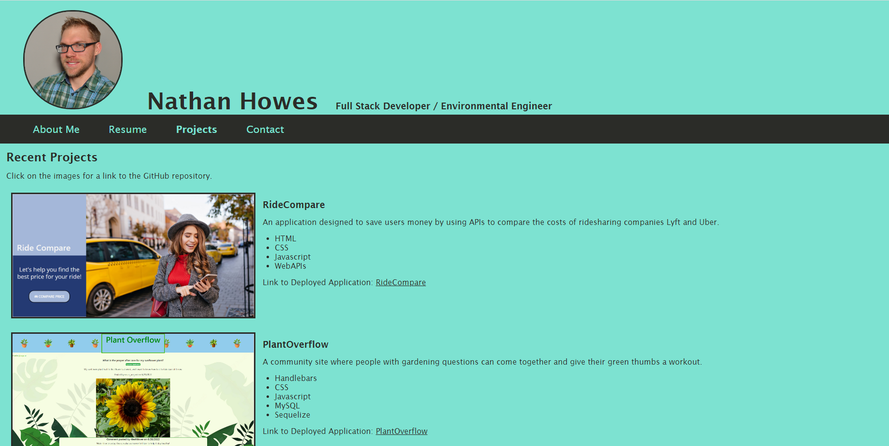
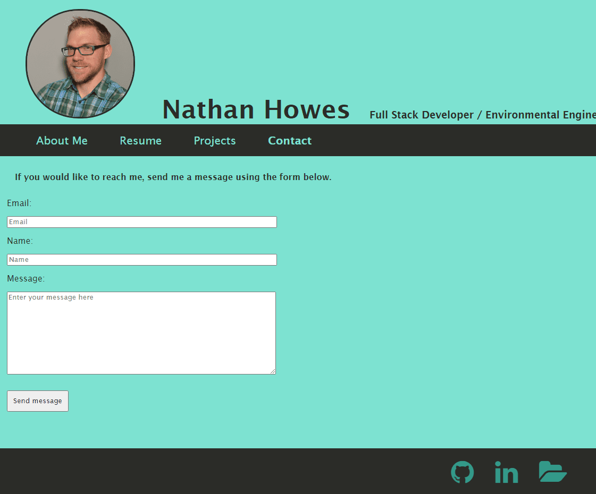

# Professional Portfolio Using React
  

  ## Description

  The application is professional portfolio for myself put together using a one -page react application and is deployed to GitHub pages.

  The application is built using ReactJS, and is a single page application. When you click the links at the top, it routes to the selected option, and the active page is highlighted. It shows six projects on the project page, and each image of a project links to the respective repository. If applicable, links to the deployed applications are also provided.

  Note: I have plans to further refine the portfolio in the near future, but wanted to get the challenge submitted.

## Table of Contents

- [Installation](#installation)
- [Usage](#usage)
- [License](#License)
- [Contributing](#contributing)
- [Tests](#tests)
- [Questions](#questions)
- [Screenshots](#screenshots)
- [Links](#links)

  ## Installation

  No installation is required to access the deployed application. 
  
  ## Usage

  The application consists of a home page with an "About Me" section, a "Resume" page, a "Contact" page and a "Portfolio" page.

  ## License

  This project is licensed under the GNU GPLv3 license. Read more about the license here:
  https://choosealicense.com/licenses/gpl-3.0/
  

  ## Contributing

  Please fork and submit a pull request.

  ## Tests

  Test using a variety of inputs.

  ## Questions

  You can reach me at GitHub; my username is nathanh635 and my profile is here: https://github.com/nathanh635. 
  You can also email me at nathanh635@gmail.com. 
  
  ## Screenshots

  Below is a screenshot of the tested application.

  
## Links

  Repository: https://github.com/nathanh635/Professional-Portfolio
  
  Deployed Page: https://nathanh635.github.io/Professional-Portfolio/

